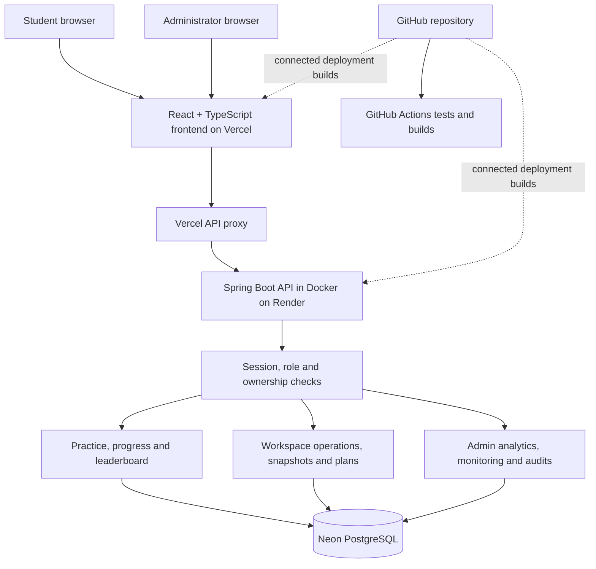

# CloudSQL Lab

**A cloud-hosted SQL learning platform with personal database workspaces and cloud resource management.**

## 1. Introduction and problem statement

Learning SQL usually means installing a database, finding suitable practice data, and tracking progress manually. In a shared lab, students also need separate working environments, while teachers need a way to manage questions and see learning activity.

CloudSQL Lab brings these tasks into one browser application. Students practice original SQL questions, earn points, create personal database workspaces, and recover their work using snapshots. Administrators manage learners and questions and monitor how the platform is being used.

The project also demonstrates practical cloud computing: managed hosting, managed PostgreSQL, secure access, logical tenant isolation, resource quotas, recovery, monitoring, and automated build checks.

- **Frontend:** React, TypeScript, and Vite, hosted on Vercel.
- **Backend:** Spring Boot, packaged in Docker and hosted on Render.
- **Production database:** Neon PostgreSQL. H2 is used only for automated tests and isolated local previews.
- **Build checks:** GitHub Actions, plus checks in the hosting build commands.

[Open CloudSQL Lab](https://cloud-sql-nu.vercel.app) · [Backend health endpoint](https://cloudsql-lab-api.onrender.com/api/health) · [Build checks](https://github.com/ishwarc04/Cloud_sql/actions/workflows/ci.yml)

## 2. Student level: what a learner can do

A student signs up, signs in, and sees their own learning workspace. Public signup always creates a **USER** account. There is no option to become an administrator through signup.

### Personal dashboard

The dashboard answers: **“How much have I learned, and what should I practice next?”**

It shows total points, solved problems, attempt count, progress by difficulty and category, and recent submissions. Progress persists in PostgreSQL, so signing out or restarting the backend does not erase it.

### SQL Practice

Students open a question, read its description, inspect the sample tables, and write a SELECT query. **Run** lets them inspect their output; **Submit solution** evaluates the answer and records an attempt.

The catalogue includes original questions across Basic Select, Advanced Select, Aggregation, Basic Join, Advanced Join, and Alternative Queries. New questions added by an administrator appear in the catalogue. HackerRank is structural inspiration only; its problem text and datasets are not copied.

| Difficulty | Points for the first successful solution |
|---|---:|
| Easy | 10 |
| Medium | 20 |
| Hard | 30 |

Solving the same question again does not award points again. Wrong answers and query errors count as submission attempts; running a query without submitting does not.

### Leaderboard and recognition

The leaderboard displays the all-time top 100 learners and the signed-in student's own rank. It ranks learners by points, then solved count, then account creation time and account ID for a stable tie-break. Administrators are excluded.

Positive-point learners in the top three receive virtual recognition:

| Position | Recognition |
|---|---|
| First | SQL Champion — gold trophy |
| Second | Query Master — silver trophy |
| Third | Rising Star — bronze trophy |

These trophies change with the current rankings. They are virtual badges, not cash or physical prizes. Other learners see display names and scores, not email addresses or internal account IDs.

### My Databases

Students can create named workspaces, inspect their tables, and run supported table operations such as CREATE, INSERT, SELECT, UPDATE, and DELETE.

Each workspace uses a separate PostgreSQL schema. Think of it as a private room inside the same managed database: the backend checks ownership before allowing access. This is **logical tenant isolation**, rather than a separate virtual machine or PostgreSQL server for every student.

### Snapshots and recovery

A learner can save a snapshot, download its JSON file, or restore it into a separate workspace. Restoring does not overwrite the original workspace and must fit within the account's database quota.

Snapshots preserve supported column types, nullability, primary keys, and rows. Each account can save three snapshots; each snapshot is limited to 2 MB and 5,000 rows. Other constraints and indexes are excluded, and generated/default columns and foreign keys are currently unsupported.

Saved snapshots are kept in the same Neon database. Downloading one gives the learner an independent copy. This is a logical recovery feature, not a complete replacement for provider disaster recovery backups.

### Plans and demo billing

The billing page demonstrates how a cloud service can offer different resource allocations.

| Plan | Database workspaces | Storage per workspace | Payment |
|---|---:|---:|---|
| Free | 2 | 10 MB | None |
| Lab Pro | 5 | 50 MB | Simulated ₹199 one-time payment |

These are the current default allocations. If backend defaults are increased, Pro keeps at least its advertised allocation.

A successful simulation persists the Pro plan and increases limits on existing and new workspaces. A declined simulation preserves the current plan. The backend determines prices and limits, and repeated requests cannot create duplicate successful upgrades. Snapshot limits remain separate.

**This is demo billing:** no real money moves, no card or UPI details are collected, and there is no real payment gateway or recurring charge. It demonstrates service tiers and resource allocation, not actual pay-per-byte billing.

## 3. Administrator level: management and cloud concepts

An administrator signs in through the same login page but lands in the admin console. The administrator does not use the student dashboard, practice, or personal database routes. Both the frontend and backend enforce the separation.

Admin accounts are provisioned only through trusted backend configuration. An administrator can create learner accounts, but the form cannot create other admins.

### Managing the learning platform

| Admin view or action | What it helps the teacher understand |
|---|---|
| Overview | Account totals, activity charts, submission outcomes, category progress, and resource allocation |
| People | Learner progress, points, attempts, workspaces, and recent submissions |
| Workspaces | Who owns each workspace and its recorded storage usage |
| Problems | Catalogue activity, unique solvers, attempts, and acceptance results |
| Activity | Recent submissions, outcomes, and awarded points |
| Create learner | Add a student account while keeping the current admin session |
| Add question | Publish an original question with structured tables, sample rows, and a validated reference query |

Reference answers stay on the backend. Admin question creation uses structured data rather than accepting arbitrary SQL seed scripts.

### Understanding the Cloud tab

The Cloud tab answers three simple questions: **“Is the service working? Who used it? How much was used?”**

| Feature | Easy explanation | Cloud computing connection |
|---|---|---|
| API traffic graph | Counts requests reaching the backend in hourly UTC buckets | Monitoring and usage measurement |
| Latency graph | Shows how long the backend takes to process requests | Performance observation |
| Failed responses | Counts HTTP errors, including permission and quota failures | Operational troubleshooting |
| Database checks | Runs a small database query and records success/failure and latency | Service health monitoring |
| Audit trail | Records important actions and the account responsible | Security and accountability |
| Consumption by account | Shows recorded requests and retained snapshot usage | Tenant-level resource accounting |
| Architecture and build checks | Shows the service chain and links to automated checks | Managed services and DevOps |

For example, creating a workspace generates usage and an audit event. Saving a snapshot adds a recovery record and storage consumption. A denied request can produce a failed-response count and an access-denied audit event.

**Check database** records a fresh connectivity sample. Production also samples approximately once a minute while the backend runs. Probe percentages describe observed database samples, not a guaranteed end-to-end uptime SLA. A sleeping backend produces gaps in sampling.

Request metrics and health samples retain seven days; audit events retain 30 days. The charts use selected recent windows, and tables show bounded recent records. Audit entries omit passwords, session tokens, raw SQL, and snapshot contents. Account consumption is application accounting, not a Neon, Render, or Vercel bill.

If PostgreSQL is unavailable, failed probe samples queue in memory until it reconnects; a process restart loses that pending queue.

### Security and resource control in everyday terms

- **Authentication:** the backend checks who is signed in. Passwords are hashed; opaque session tokens use HttpOnly cookies, and only token hashes are stored in PostgreSQL. Logout revokes the session.
- **Authorization:** being signed in does not grant access to every resource. Roles and ownership determine which APIs and workspaces an account can use.
- **Exact-origin CORS and request protection:** only configured frontend origins are accepted, and mutations require the application's protection header.
- **Secret management:** database credentials and trusted admin provisioning values stay in backend environment variables.
- **Quotas:** the backend enforces plan limits. Account-row locks serialize workspace mutations and upgrades, preventing concurrent requests from bypassing account limits.
- **Controlled SQL execution:** validation, a five-second query timeout, and a 200-row output limit bound supported operations.
- **Persistence and initialization:** existing PostgreSQL records survive restarts; initialization is idempotent and preserves existing practice data.

Storage checks use measured table/index allocation. An over-limit write is rolled back, although PostgreSQL physical allocation or bloat can remain. The quota is an application policy, not a reservation of separate provider disk space.

## 4. System architecture



### Follow one request through the system

1. A learner submits a SQL solution in the browser.
2. The frontend sends an API request through Vercel's fixed-backend proxy. The proxy keeps session cookies on the frontend's origin.
3. Render's backend validates the session, role, and supported SQL operation.
4. The backend evaluates the query against the question's isolated dataset.
5. It records the submission and updates progress in PostgreSQL. First-solve points are awarded transactionally.
6. The result returns to the browser, and the learner can refresh their dashboard or leaderboard.

Neon stores accounts, sessions, progress, submissions, custom questions, workspace metadata and tables, snapshots, plans, demo receipts, and operational records. The browser never connects directly to Neon using database credentials.

### Where the cloud concepts appear

| Concept | Evidence in this project |
|---|---|
| SaaS | Students use a complete learning application through a browser |
| Managed hosting / PaaS | Render hosts the backend; Vercel hosts the frontend and serverless proxy |
| Containerization | A multi-stage Dockerfile builds and packages the Spring Boot service |
| Managed SQL | Neon provides persistent PostgreSQL storage |
| Multi-tenancy | Account ownership checks and separate workspace schemas |
| Identity and access management | Secure sessions and separate USER/ADMIN permissions |
| Resource accounting | Database/storage quotas, plan allocations, and account usage |
| Recovery | Logical snapshots, downloads, and restoration |
| DevOps | GitHub Actions and hosting builds run automated checks |

## 5. Suggested demonstration for the teacher

Start with this introduction:

> “CloudSQL Lab lets students learn SQL without installing a database locally. It combines SQL practice and personal workspaces with secure cloud hosting, managed PostgreSQL, monitoring, quotas, and recovery.”

Then demonstrate one connected journey:

1. **Student login:** explain that public signup creates only a learner.
2. **Practice:** open an original question, inspect its dataset, run SQL, and submit a solution.
3. **Progress:** show points and attempts. Resubmit the accepted solution to demonstrate that points are awarded only once.
4. **Leaderboard:** show the learner's rank and virtual top-three recognition.
5. **Workspace:** create a database workspace, then create a table, insert a row, and select it.
6. **Recovery:** save a snapshot, restore it under a new name, and query the restored rows.
7. **Demo upgrade:** show the Free quota, simulate a successful payment, and show the increased allocation in My Databases.
8. **Admin:** sign out and log in as admin. Show learner management, question creation, and analytics.
9. **Cloud:** refresh after those actions, switch between Requests and Latency, click Check database, and find the relevant audit events and account consumption.
10. **Deployment evidence:** show the Dockerfile, a Render deployment, Neon database tables without exposing credentials, and successful GitHub Actions checks.

Run this workspace example one statement at a time:

```sql
CREATE TABLE books (id INTEGER PRIMARY KEY, title VARCHAR(60));
```

```sql
INSERT INTO books VALUES (1, 'Cloud Computing');
```

```sql
SELECT * FROM books;
```

Before presenting, ensure Render is running the latest commit and shows **Live**. Refresh the Vercel frontend afterward. A newer frontend with an older backend can show “Not Found” for recently added features.

## Repository layout

```text
Cloud_sql/
├── frontend/              React app, assets, Vite/TypeScript config and proxy tests
│   ├── src/               Pages, features, authentication and layout
│   ├── public/            Static assets
│   ├── api/proxy.mjs      Frontend API proxy implementation
│   ├── tests/             Proxy tests
│   └── package.json       Frontend dependencies and scripts
├── backend/               Spring Boot API, Java tests, PostgreSQL initialization
│   ├── src/main/          Backend application and configuration
│   ├── src/test/          Backend tests
│   ├── Dockerfile         Render container build
│   └── pom.xml            Java dependencies and build
├── api/proxy.mjs          Thin Vercel entry point importing the frontend proxy
├── .github/workflows/     Automated build checks
├── package.json           Convenience scripts forwarding to frontend/
├── render.yaml            Backend hosting configuration
├── vercel.json            Frontend build, output and API routing configuration
└── README.md              Project explanation and setup
```

Keep Vercel's project Root Directory at the repository root. Its configuration installs dependencies in `frontend/` and serves `frontend/dist`; the small root API entry point preserves existing session routing. Render continues to use `backend/Dockerfile` and the `backend` Docker context. Frontend environment values belong in `frontend/.env.local`; backend examples are in `backend/.env.example`. Local dependency folders, builds, secrets and temporary reference files are excluded from Git.

## 6. Running and verifying the project

Use Node.js 22 or later, Java 21 or later, and Maven. Production uses the existing Neon/Render/Vercel setup; a new provider account is not required for every feature.

### Local configuration

Copy `frontend/.env.example` to `frontend/.env.local` for Vite and set `VITE_API_BASE_URL=http://localhost:8080`. Set backend variables in the terminal starting Spring Boot:

```powershell
$env:DATABASE_URL="jdbc:postgresql://YOUR-NEON-HOST/YOUR-DATABASE?sslmode=require"
$env:DATABASE_USERNAME="YOUR_NEON_USERNAME"
$env:DATABASE_PASSWORD="YOUR_NEON_PASSWORD"
$env:CORS_ALLOWED_ORIGINS="http://localhost:5173"
$env:AUTH_COOKIE_SECURE="false"
$env:AUTH_COOKIE_SAME_SITE="Lax"
cd backend
mvn spring-boot:run
```

In another terminal at the repository root:

```powershell
npm ci --prefix frontend
npm run dev
```

Use the same hostname for both local services. Backend variables are read from the process environment; copying a frontend `.env` file does not load them into Spring Boot. Never commit real credentials.

### Production configuration

- **Render:** use `backend/Dockerfile` with `backend` as the Docker context. Set `DATABASE_URL`, `DATABASE_USERNAME`, `DATABASE_PASSWORD`, and `CORS_ALLOWED_ORIGINS`. Use `/api/health` as the health-check path.
- **CORS:** set the exact frontend origin, such as `https://cloud-sql-nu.vercel.app`, without a trailing slash or wildcard.
- **Sessions:** keep `AUTH_COOKIE_SECURE=true` and `AUTH_COOKIE_SAME_SITE=Lax` in production.
- **Vercel:** deploy the repository root. Set server-side `BACKEND_API_URL=https://cloudsql-lab-api.onrender.com`. The proxy also supports the existing `VITE_API_BASE_URL` configuration as its upstream fallback.
- **Admin provisioning:** set backend-only `ADMIN_EMAIL` and `ADMIN_PASSWORD` for a new admin email. The password must be 12–128 characters. Initialization preserves an existing admin and refuses to promote a public user with the same email. Provisioning variables can be removed afterward; the persisted admin remains.

### Automated checks

```powershell
cd backend
mvn verify
cd ..
npm run lint
npm run test:proxy
npm run build
```

GitHub Actions runs backend verification and frontend lint, proxy tests, and build for pull requests and pushes to main. Render's Docker build runs backend verification, and Vercel's build runs frontend checks. These provide build gates; repository branch protection is a separate setting.

## 7. Logical work distribution among four members

This is a suggested division of development ownership and presentation responsibilities. Each member should understand their module and one complete request through the architecture. Use actual contribution records when describing who implemented the work.

| Member | Main responsibility | Related cloud concepts | What they should demonstrate |
|---|---|---|---|
| 1 | Student frontend, SQL practice, dashboard, leaderboard and rewards | SaaS delivery and browser-to-API interaction | Student journey, first-solve points, rankings, and Vercel hosting |
| 2 | Authentication, sessions, role/ownership protection and admin learner/question management | Identity management, authorization and tenant access control | USER/ADMIN separation, persisted login, protected APIs, and management forms |
| 3 | Neon PostgreSQL, personal workspaces, snapshots, plan upgrades and quota enforcement | Managed SQL, logical multi-tenancy, recovery and resource allocation | Workspace SQL, snapshot restoration, demo payment, and increased quotas |
| 4 | Admin Cloud monitoring, audit/usage views, Docker, deployment and CI | Cloud operations, accountability, containerization and DevOps | Traffic/latency charts, database probes, audit events, Render build, and GitHub checks |

**Why this split works:** the four parts cover the service students use, the rules controlling access, the data and resources they consume, and the operations that keep the service observable and deployable. Members 2 and 3 agree on account ownership rules; members 3 and 4 agree on how usage and recovery events appear in monitoring.

## 8. Future scope

The following are proposed improvements, not claims about features already implemented.

| Improvement | Benefit and cloud connection |
|---|---|
| Stronger recovery | Support more schema features and independent encrypted backup storage; test recovery after a database failure |
| Real payment integration | Use a provider's sandbox first, then verified webhooks and server-side payment confirmation before production charges |
| Better monitoring and alerts | Add external uptime checks, alerting, and service-level objectives based on defined measurements |
| Request rate limits | Protect against excessive traffic and improve fair resource usage |
| Account controls | Add verified email, password recovery, account status management, and stronger admin authentication |
| Privacy controls | Let learners choose their public leaderboard display name or participation preference |
| More original learning content | Add more datasets, hints, and feedback without exposing reference solutions |
| Durable achievement rewards | Introduce defined seasons and persisted awards, with published eligibility rules |
| Scaling experiments | Test multiple backend instances, shared rate limits, load balancing, and connection-pool limits under measured load |
| Advanced cloud infrastructure | Explore Kubernetes orchestration and private networking where the hosting plan and syllabus require them |

For the current presentation, focus on the real implemented features. Describe workspace schemas as logical isolation and payment as a simulation. Kubernetes, separate virtual machines, VPC/VPN networking, real charges, and automatic infrastructure scaling would require additional work.
